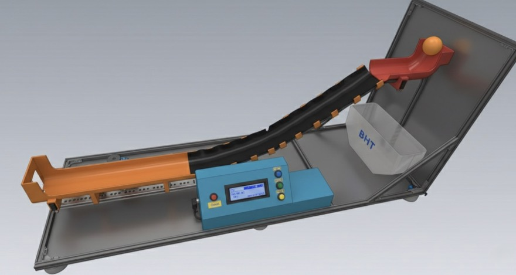

# Automated Ball-Track Test Bench for Statistical Analysis

*Overview of the automated ball-track test bench prototype.*

Mechatronic engineering project focused on the automated acquisition and statistical evaluation of time, speed, and force data.

## Project Overview
This project presents an automated ball-track test bench developed for reproducible measurement and analysis of motion-related parameters. The system combines mechanical design, sensor integration, embedded control, and statistical evaluation in one mechatronic setup. It also includes an automated mechanism for switching between three predefined angle positions, enabling structured and repeatable measurements under different operating conditions.

## Key Objectives
- Automate the acquisition of measurement data
- Improve repeatability compared to manual measurement
- Measure time, speed, and force within one test system
- Support statistical evaluation of measurement quality

## Core Components
- Mechanical design developed in Creo Parametric
- Arduino-based control and sensor integration
- Automated angle adjustment between three predefined positions
- IR sensors, FSR sensor, and LCD interface
- 3D-printed parts for prototyping and structural implementation

## Main Focus Areas
- Mechatronic system development
- Embedded measurement systems
- Sensor integration and automated angle control
- Mechanical design and prototyping
- Statistical analysis of measurement data

## Project Files
- [Arduino control code](code/arduino-control.ino)
